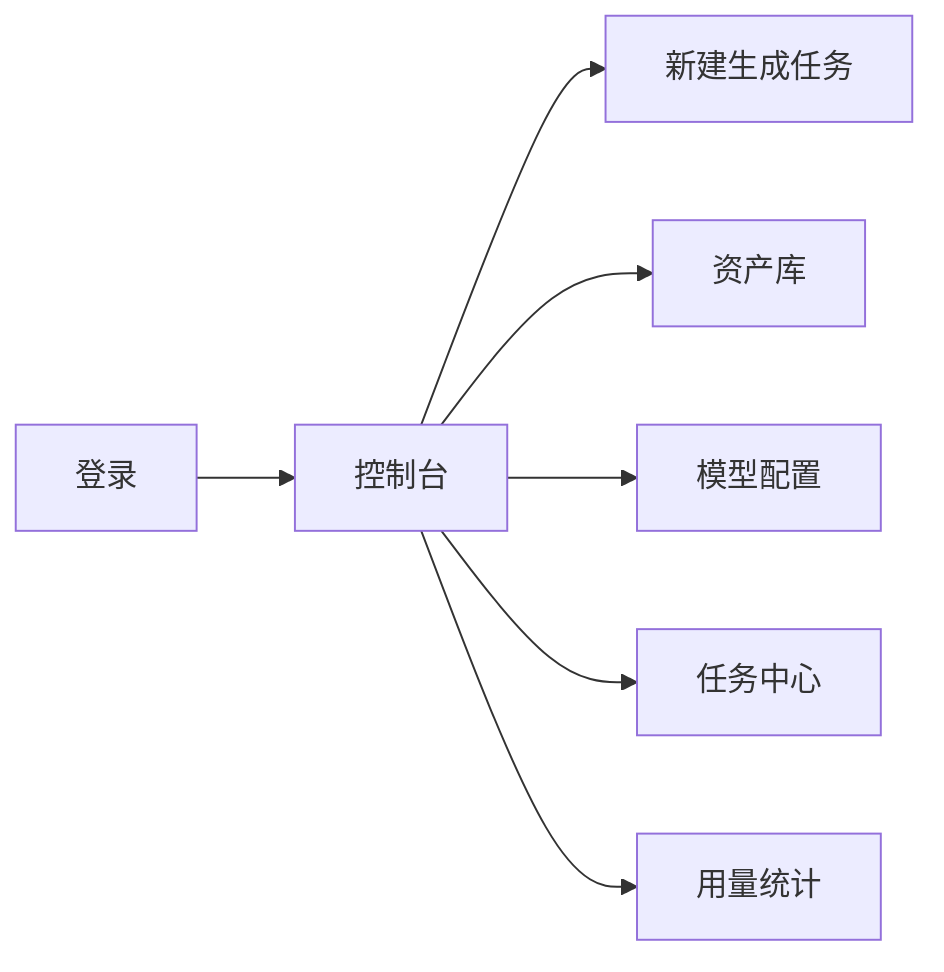

# 统一生图 + 视频平台 MVP 方案

## 目标

做一个统一创作平台，用户在同一个账号里完成：

- 生图
- 生视频
- 图生视频
- 素材管理
- 模型接入配置

平台支持自定义模型 `base URL` 和 `API Key`，可接 OpenAI 兼容接口，也方便后续接第三方模型或私有模型。

## MVP 功能清单

### P0

- 登录 / 注册 / 退出
- 创建项目
- 生图：文生图、图生图
- 生视频：文生视频、图生视频
- 任务队列：排队、生成中、成功、失败
- 资产库：图片、视频、提示词、参考图
- 模型配置：平台内置模型 + 自定义 `URL/API Key`
- 基础配额 / 次数统计

### P1

- 局部重绘 / 参考图控制
- 批量生成
- 结果收藏 / 复用
- 提示词模板
- 生成历史版本
- 任务详情页
- 团队协作

### P2

- 角色卡 / 风格卡
- 视频首尾帧
- 字幕 / 配音
- 工作流编排
- 企业级审计 / 权限

## 页面结构 / 原型

### 1. 登录页

- 账号密码登录
- 可预留手机号 / 邮箱登录入口

### 2. 控制台

- 今日生成次数
- 生图 / 视频快捷入口
- 最近任务
- 常用模板

### 3. 生成页

- 左侧：提示词、参考图、参数、模型选择
- 右侧：预览区、生成结果、历史版本
- 顶部 Tab：`生图` / `生视频` / `图生视频`

### 4. 任务中心

- 任务列表
- 状态筛选
- 重试 / 删除 / 复制参数

### 5. 资产库

- 图片
- 视频
- 提示词
- 收藏夹

### 6. 模型配置

- 模型名称
- 模型类型
- `base URL`
- `API Key`
- 默认模型
- 是否启用

### 7. 系统设置

- 用户管理
- 角色权限
- 配额规则
- 审核配置

## 技术栈

### 后端

- `Spring Boot 3.0.5`
- `MyBatis-Plus`
- `MySQL`
- `Redis`
- `Sa-Token`

### 前端管理系统

- `Vue 3`
- `Vite`
- `Naive UI`
- `Pinia`
- `Axios`

## 推荐后端模块

- `auth`：登录鉴权
- `user`：用户和角色
- `project`：项目空间
- `model-provider`：模型提供方配置
- `generation-task`：生图 / 视频任务
- `asset`：素材资产
- `prompt-template`：提示词模板
- `quota`：次数与额度
- `system`：系统设置

## 推荐数据库表

- `user`
- `role`
- `project`
- `model_provider`
- `generation_task`
- `asset`
- `prompt_template`
- `quota_record`
- `system_config`

## 接口建议

- `POST /api/auth/login`
- `GET /api/model-providers`
- `POST /api/model-providers`
- `POST /api/generation/image`
- `POST /api/generation/video`
- `GET /api/tasks`
- `GET /api/assets`
- `POST /api/prompts`

## 核心原则

- 一个入口同时管理生图和视频
- 一个素材库复用所有结果
- 一个模型配置层接所有提供方
- 一个任务中心跟踪所有生成流程

