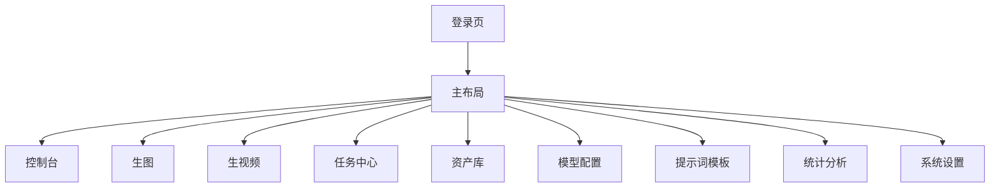

# 统一生图 + 视频平台：接口、数据库、路由设计

## 1. 后端接口设计

### 1.1 认证

- `POST /api/auth/login`
- `POST /api/auth/logout`
- `GET /api/auth/me`

### 1.2 项目

- `GET /api/projects`
- `POST /api/projects`
- `PUT /api/projects/{id}`
- `DELETE /api/projects/{id}`

### 1.3 模型配置

- `GET /api/model-providers`
- `POST /api/model-providers`
- `PUT /api/model-providers/{id}`
- `DELETE /api/model-providers/{id}`
- `POST /api/model-providers/{id}/test`

字段建议：

- `name`
- `type`：`openai` / `image` / `video` / `custom`
- `baseUrl`
- `apiKey`
- `modelName`
- `enabled`
- `isDefault`

### 1.4 生图 / 生视频

- `POST /api/generation/image`
- `POST /api/generation/video`
- `POST /api/generation/image/variation`
- `POST /api/generation/video/image-to-video`

请求建议包含：

- `projectId`
- `providerId`
- `modelName`
- `prompt`
- `negativePrompt`
- `referenceAssets`
- `size`
- `count`
- `options`

### 1.5 任务

- `GET /api/tasks`
- `GET /api/tasks/{id}`
- `POST /api/tasks/{id}/retry`
- `DELETE /api/tasks/{id}`

### 1.6 素材库

- `GET /api/assets`
- `POST /api/assets/upload`
- `DELETE /api/assets/{id}`
- `POST /api/assets/{id}/favorite`

### 1.7 提示词模板

- `GET /api/prompt-templates`
- `POST /api/prompt-templates`
- `PUT /api/prompt-templates/{id}`
- `DELETE /api/prompt-templates/{id}`

### 1.8 配额与统计

- `GET /api/quota/summary`
- `GET /api/quota/records`
- `GET /api/stats/overview`

## 2. 数据库表设计

### 2.1 `user`

- `id`
- `username`
- `password`
- `nickname`
- `avatar`
- `status`
- `created_at`
- `updated_at`

### 2.2 `role`

- `id`
- `role_code`
- `role_name`
- `status`

### 2.3 `project`

- `id`
- `user_id`
- `name`
- `description`
- `status`

### 2.4 `model_provider`

- `id`
- `project_id`
- `name`
- `type`
- `base_url`
- `api_key`
- `model_name`
- `enabled`
- `is_default`
- `config_json`

### 2.5 `generation_task`

- `id`
- `project_id`
- `provider_id`
- `task_type`：`image` / `video`
- `prompt`
- `negative_prompt`
- `status`
- `progress`
- `request_json`
- `response_json`
- `result_asset_id`
- `error_message`

### 2.6 `asset`

- `id`
- `project_id`
- `task_id`
- `asset_type`：`image` / `video` / `reference`
- `file_name`
- `file_url`
- `thumb_url`
- `mime_type`
- `file_size`
- `favorite`

### 2.7 `prompt_template`

- `id`
- `project_id`
- `name`
- `content`
- `tag`
- `status`

### 2.8 `quota_record`

- `id`
- `user_id`
- `project_id`
- `task_id`
- `quota_type`
- `amount`
- `remark`

### 2.9 `system_config`

- `id`
- `config_key`
- `config_value`
- `config_group`
- `remark`

## 3. 前端路由设计

### 3.1 路由建议

- `/login`
- `/`
- `/dashboard`
- `/generate/image`
- `/generate/video`
- `/tasks`
- `/assets`
- `/model-providers`
- `/prompt-templates`
- `/stats`
- `/settings`

### 3.2 菜单结构

- 控制台
- 生图
- 生视频
- 任务中心
- 资产库
- 模型配置
- 提示词模板
- 统计分析
- 系统设置

## 4. 关键实现原则

- 生图和视频共用同一套 `provider` 配置。
- 所有生成请求都落入统一任务表。
- 图片和视频结果都进入统一资产库。
- `baseUrl + apiKey` 必须支持项目级隔离。
- 前端页面尽量复用同一套生成表单，只切换生成类型。

